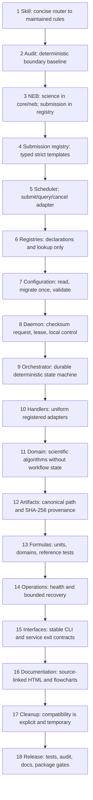
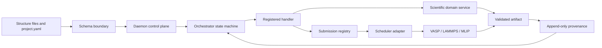

# Architecture implementation rules (1–18)

This is the enforceable architecture map. Each numbered box has one owner and one principal
rule; tests and the architecture audit turn these boundaries into release gates.

## Box contracts

| Box | Owner | Must | Must not |
|---:|---|---|---|
| 1 | `skills/hpca-production-workflow` | Route work to focused rule references | Duplicate the full manuals |
| 2 | architecture audit | Fail on new violations deterministically | Mutate source while auditing |
| 3 | `hpca.core.neb` | Generate/parse scientific NEB data | Render or submit SLURM jobs |
| 4 | `hpca.registry.submission` | Declare and validate template parameters | Silently ignore unknown settings |
| 5 | `hpca.scheduler` | Submit, query, cancel, express dependencies | Own scientific input templates |
| 6 | `hpca.registry` | Own paths, INCAR, stages, submissions | Orchestrate or inspect live jobs |
| 7 | project schema/I/O | Normalize once and report field paths | Maintain competing validators |
| 8 | `hpca.daemon` | Use immutable requests, leases, atomic transitions | Embed scientific stage behavior |
| 9 | orchestrator | Reconcile dependency/state evidence | Implement scientific equations |
| 10 | handlers | Translate stage services to workflow state | Bypass registry/scheduler boundaries |
| 11 | domain packages | Accept inputs and return scientific results | Read daemon inbox or mutate orchestration |
| 12 | artifact service | Record relative identity, hash, producer, format | Treat existence alone as scientific validity |
| 13 | `hpca.science` | State units and reject invalid domains | Hide conversions in handlers |
| 14 | monitor/recovery | Read health; retry classified transient faults | Retry permanent/configuration faults forever |
| 15 | CLI/services | Target one project and offer JSON output | Cancel unrelated user jobs |
| 16 | `docs/` | Match executable behavior and equations | Maintain hand-edited divergent HTML |
| 17 | compatibility shims | Point one-way to canonical modules with removal target | Receive new implementation logic |
| 18 | CI/release | Gate tests, strict audit, docs, package build | Publish from a dirty or failing tree |

## Runtime ownership flow

