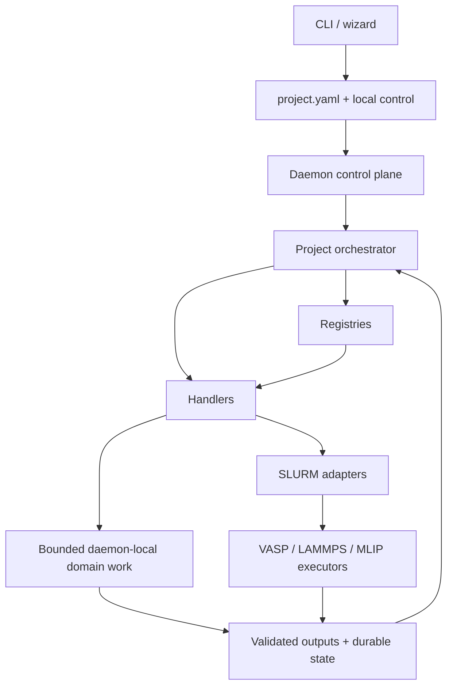

# Architecture

## Responsibilities

- `hpca.registry`: stable declarations and lookups; no execution or workflow mutation.
- `hpca.orchestrator.handlers`: one operational adapter per scientific stage.
- `hpca.orchestrator`: dependency ordering, reconciliation, dispatch and state transitions.
- `hpca.daemon`: inbox requests, leases, desired state, supervision and wall-time handoff.
- `hpca.core`: shared domain policies, schemas, state-independent scientific utilities and
  external-operation adapters.
- Analysis/simulation packages: scientific calculations with explicit units and validation.

## Invariants

- Durable writes are atomic where partial files could be mistaken for valid state.
- Dispatch is idempotent and follows reconciliation.
- Attempts are bounded and recorded before execution.
- Heavy computation stays on SLURM.
- Scientific completion is evidence-based.
- Category behavior comes from one category registry; paths/templates/DAGs each have one owner.
