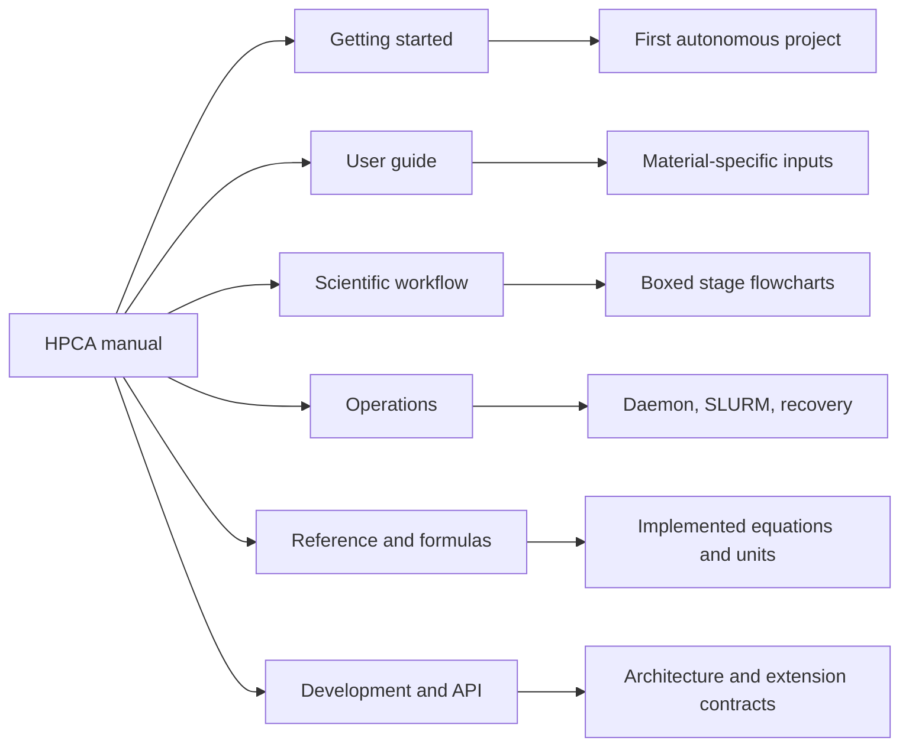

# HPCA documentation

HPCA is an autonomous computational-materials workflow engine for HPC systems. A scientist
describes a material and requested calculations in `project.yaml`; HPCA designs the required
cells, runs validated local steps, submits expensive calculations to SLURM, and preserves
enough state to resume safely after process or scheduler interruption.

## Choose your path

| Audience | Start here | You will learn |
|---|---|---|
| Computational scientist | [First autonomous project](getting-started/first-project.md) | Create, start, inspect, stop, and resume a project |
| HPC operator | [Daemon and SLURM](operations/daemon.md) | Deploy the daemon, supervise handoff, and recover failures |
| HPCA developer | [Architecture](development/architecture.md) | Extend registries, stages, handlers, and orchestration safely |

## System boundary

HPCA owns project definition, workflow state, input generation, scheduler coordination,
validation, analysis, and reporting. VASP, LAMMPS, DeepMD/MACE, PACKMOL, and SLURM remain
external executors. HPCA records their commands, job identifiers, outputs, and validation
evidence; it does not treat process exit alone as scientific success.

The authoritative behavior is the current package code. Historical design records are
available in the [archive](archive/index.md), but must not be used as operating instructions.

## Documentation map

