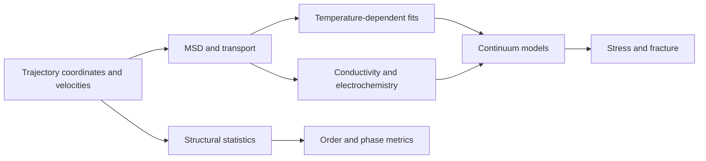

# Mathematical formula reference

This page documents formulas implemented or directly consumed by HPCA. Symbols use SI units
unless a different unit is stated. A formula's presence does not guarantee that its stage is
enabled for every material category.

## Constants and conversions

| Quantity | Value used |
|---|---|
| Boltzmann constant | $k_B=8.617333\times10^{-5}$ eV K$^{-1}$ for Arrhenius fits |
| Boltzmann constant, SI | $k_B=1.381\times10^{-23}$ J K$^{-1}$ |
| Faraday constant | $F=96485.33212$ C mol$^{-1}$ |
| Gas constant | $R=8.314462618$ J mol$^{-1}$ K$^{-1}$ |
| Elementary charge | $q=1.602\times10^{-19}$ C |
| Diffusion conversion | $1\ \text{Å}^2/\text{ps}=10^{-8}$ m$^2$ s$^{-1}$ |

## Trajectory and transport formulas

### Mean-squared displacement

$$
\operatorname{MSD}(\tau)=\frac{1}{N N_o}\sum_{i=1}^{N}\sum_{t_0}
\left|\mathbf r_i(t_0+\tau)-\mathbf r_i(t_0)\right|^2
$$

$N$ is the number of mobile ions and $N_o$ the number of valid time origins. Coordinates must
be unwrapped. HPCA discards the configured equilibration fraction and normally limits lag time
to half the usable trajectory.

### Einstein self-diffusion coefficient

$$D=\frac{1}{2d}\frac{d\operatorname{MSD}}{dt}$$

For isotropic 3D transport, $d=3$ and $D=m/6$; for a directional component, $D_\alpha=m_\alpha/2$.
HPCA fits the configured linear window, clips negative fitted diffusion to zero, and reports
$R^2$, slope uncertainty, m$^2$/s, and cm$^2$/s.

### Arrhenius diffusion

$$D(T)=D_0\exp\left(-\frac{E_a}{k_BT}\right),\qquad
\ln D=\ln D_0-\frac{E_a}{k_B}\frac{1}{T}$$

If $m$ is the fitted slope of $\ln D$ against $1/T$, then $E_a=-m k_B$ and
$D_0=\exp(b)$. At least two finite positive diffusion values are required.

### Nernst–Einstein conductivity

$$\sigma=\frac{Dq^2c}{k_BT}$$

$c$ is carrier number density in m$^{-3}$. HPCA's current electrochemistry handler evaluates
this estimate at 300 K and treats it as an uncorrelated-carrier approximation.

### Haven ratio

Two conventions occur in the package and must be labeled with the output source:

$$H_R^{(hopping)}=\frac{D_{\mathrm{tracer}}}{D_{\mathrm{charge}}},\qquad
H_R^{(handler)}=\frac{D_\sigma}{D_{\mathrm{tracer}}}$$

This documented distinction prevents reciprocal values from being compared without conversion.

## Structural and dynamical formulas

### Radial distribution and coordination

$$g_{ab}(r)=\frac{n_{ab}(r,r+\Delta r)}{N_a\rho_b\,4\pi r^2\Delta r},\qquad
CN_{ab}(r)=4\pi\rho_b\int_0^r r'^2g_{ab}(r')\,dr'$$

HPCA uses minimum-image distances and exact spherical-shell volumes for histogram
normalization. Self-pairs are excluded when $a=b$.

### Self Van Hove function and non-Gaussian parameter

$$G_s(r,t)=\frac{1}{N}\sum_i\left\langle\delta\!\left(r-
|\mathbf r_i(t_0+t)-\mathbf r_i(t_0)|\right)\right\rangle_{t_0}$$

$$\int_0^\infty4\pi r^2G_s(r,t)\,dr=1,\qquad
\alpha_2(t)=\frac{3\langle r^4(t)\rangle}{5\langle r^2(t)\rangle^2}-1$$

### Velocity autocorrelation and vibrational density of states

$$C_v(\tau)=\frac{\langle\mathbf v(t+\tau)\cdot\mathbf v(t)\rangle}
{\langle\mathbf v(t)\cdot\mathbf v(t)\rangle},\qquad
g(\omega)\propto\operatorname{Re}\int_0^\infty C_v(t)e^{-i\omega t}\,dt$$

HPCA applies a Hann window and zero padding before the FFT used for VDOS.

### Lindemann criterion

$$\delta_L=\frac{\sqrt{\langle|\mathbf r_i-\langle\mathbf r_i\rangle_t|^2\rangle_i}}
{d_{nn}}$$

$d_{nn}$ is the mean nearest-neighbor distance. The implemented reporting threshold is 0.12;
values below 0.08 are labeled ordered.

### Steinhardt bond-order parameter

$$q_{lm}(i)=\frac{1}{N_b(i)}\sum_{j=1}^{N_b(i)}Y_{lm}(\hat{\mathbf r}_{ij}),\qquad
Q_l(i)=\sqrt{\frac{4\pi}{2l+1}\sum_{m=-l}^{l}|q_{lm}(i)|^2}$$

HPCA uses $l=6$ for the $Q_6$ crystalline-order metric.

## Continuum transport formulas

### Reference-temperature Arrhenius model

$$D(T)=D_{ref}\exp\left[-\frac{E_a}{k_B}\left(\frac1T-\frac1{T_{ref}}\right)\right]$$

### Vogel–Tammann–Fulcher conductivity

$$\sigma(T)=A\exp\left[-\frac{B}{T-T_0}\right],\qquad T>T_0$$

### Nernst–Planck flux

$$J=-D\left(\frac{dc}{dx}+\frac{zF}{RT}c\frac{dV}{dx}\right),\qquad
\beta=\frac{zFV}{RT}$$

For the implemented linear potential and boundary condition:

$$c(\xi)=c_0\frac{e^{\beta\xi}-1}{e^\beta-1},\qquad
J=-\frac{Dc_0\beta}{L}\frac{e^{\beta\xi}}{e^\beta-1}$$

The $\beta\rightarrow0$ limit is $c=c_0\xi$ and $J=-Dc_0/L$.

### Effective-medium diffusivity

$$D_{series}^{-1}=\frac{\phi_1}{D_1}+\frac{\phi_2}{D_2},\qquad
D_{parallel}=\phi_1D_1+\phi_2D_2$$

$$\sum_i\phi_i\frac{D_i-D_{eff}}{D_i+2D_{eff}}=0\quad\text{(Bruggeman)}$$

$$D_{MG}=D_m\frac{D_i+2D_m+2\phi_i(D_i-D_m)}
{D_i+2D_m-\phi_i(D_i-D_m)}$$

### Fick diffusion and explicit update

$$\frac{\partial c}{\partial t}=D\frac{\partial^2c}{\partial x^2},\qquad
c_i^{n+1}=c_i^n+r(c_{i+1}^n-2c_i^n+c_{i-1}^n),\quad
r=\frac{D\Delta t}{\Delta x^2}\le0.5$$

## Interface, phase, and electrochemical formulas

### SEI/interphase growth

$$\delta(t)=\sqrt{2k_{SEI}t},\qquad L(t)=At^n$$

For coupled reactive diffusion:

$$\frac{dL}{dt}=\frac{D_{SEI}}{k_{rxn}L},\qquad
L(t)=\sqrt{L_0^2+\frac{2D_{SEI}}{k_{rxn}}t}$$

### Allen–Cahn phase field

$$g(\phi)=\phi^2(1-\phi)^2,\quad g'(\phi)=2\phi(1-\phi)(1-2\phi)$$

$$\frac{\partial\phi}{\partial t}=M\left(Wg'(\phi)-\kappa\nabla^2\phi\right)$$

This is the sign convention currently implemented by HPCA.

### KJMA crystallization

$$X(t)=1-\exp(-kt^n)$$

### Butler–Volmer and Tafel kinetics

$$j(\eta)=j_0\left[\exp\left(\frac{\alpha_aF\eta}{RT}\right)-
\exp\left(-\frac{\alpha_cF\eta}{RT}\right)\right]$$

$$j\approx j_0\exp\left(\frac{\alpha F\eta}{RT}\right),\qquad
b=\frac{2.303RT}{\alpha F}$$

### Open-circuit voltage from DFT energies

For insertion/extraction of $\Delta n$ monovalent ions between states 1 and 2:

$$V=-\frac{E_2-E_1-\Delta n\,\mu_{metal}}{\Delta n\,e}$$

When energies are in eV and one electron is transferred per ion, the numerical energy
difference per ion is directly expressed in volts with the stated sign convention.

## Mechanical formulas

### Vegard strain and stress

$$\epsilon_V(c)=\frac{\Omega}{V_{ref}}c,\qquad
\sigma(c)=\frac{E\epsilon_V(c)}{1-\nu}$$

The current implementation uses $V_{ref}=10^4$ Å$^3$ as an empirical scale. This assumption
must be reported; it is not a first-principles unit-cell volume calculation.

### Critical flaw size

$$a_c=\frac{1}{\pi}\left(\frac{K_{IC}}{\sigma}\right)^2$$

## Model-quality formulas

$$\operatorname{RMSE}(y,\hat y)=\sqrt{\frac1N\sum_{i=1}^N(y_i-\hat y_i)^2},\qquad
R^2=1-\frac{\sum_i(y_i-\hat y_i)^2}{\sum_i(y_i-\bar y)^2}$$

Energy RMSE is reported per atom where specified; force RMSE uses eV Å$^{-1}$. Acceptance
thresholds come from current platform configuration and must accompany the model version,
dataset split, and test population.

## Provenance and limitations

The unit-validated shared primitives are implemented in `hpca.science.formulas`; broader
implementing sources are `hpca.analysis`, `hpca.continuum.models`, and the h06/h08
handlers. Formula changes require corresponding code tests, unit tests, this page, and regenerated
HTML. Numerical approximations, fit windows, correlation assumptions, and empirical scaling
must be preserved in reported methods rather than presenting every equation as exact physics.
