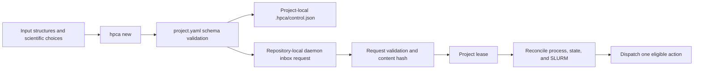
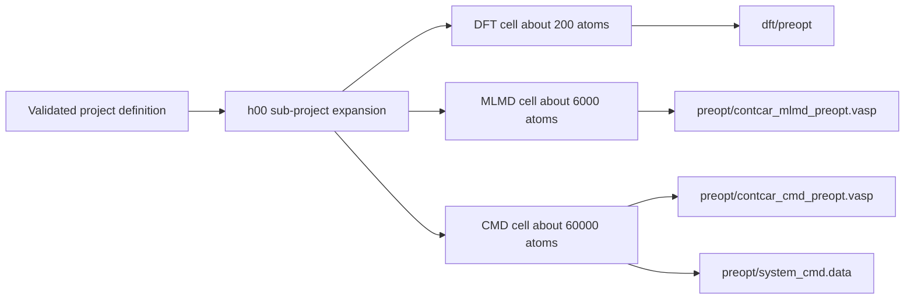
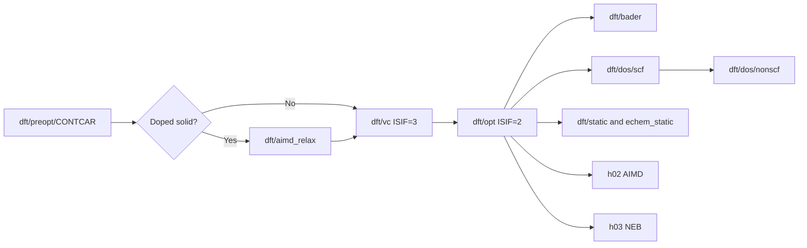
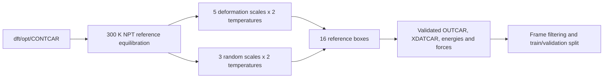
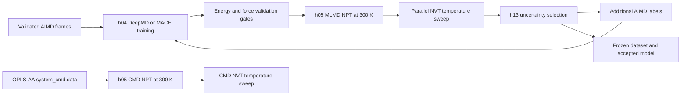
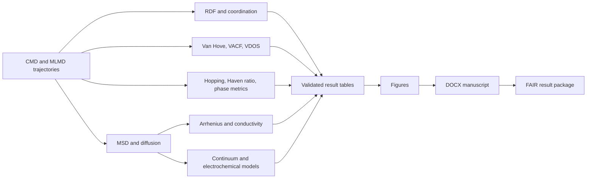

# Boxed workflow flowcharts

Each box below is an independently observable workflow section. Arrows represent required
data or control dependencies; parallel branches do not imply a shared execution lane.

## 1. Project and control plane

## 2. Design and preoptimization

## 3. DFT relaxation and characterization

## 4. AIMD reference dataset

For molecular/liquid/polymer systems, these boxes generate diverse training configurations;
they do not repeat every production molarity.

## 5. MLIP, production MD, and active learning

## 6. Analysis, models, and publication outputs

The equations behind every analysis and model box are listed in the
[mathematical formula reference](../reference/formulas.md).
