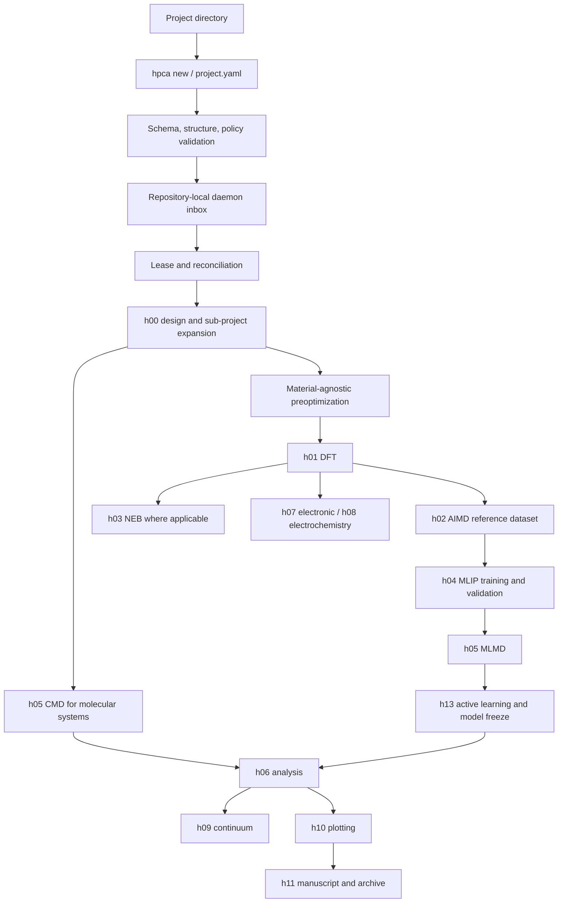
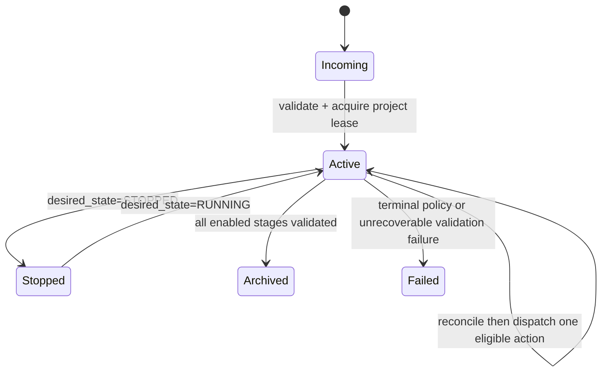
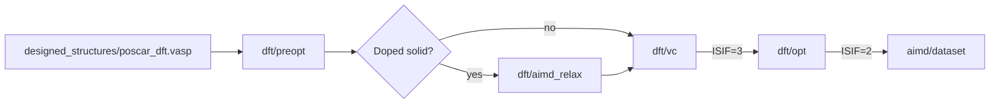

# End-to-end workflow

## Control flow

Every poll reconciles durable state with the local process table and SLURM before dispatch.
Submission attempts are consumed before execution, so a daemon crash cannot bypass autonomy
limits. Completion requires stage-specific output validation, not merely a zero exit status.

## DFT and AIMD ordering

Preoptimization is material-type agnostic and never resides below `aimd/`. Molecular AIMD
generates diverse MLIP reference configurations independent of the full production-molarity
sweep. The reference NPT temperature is fixed at 300 K; production temperatures remain
configurable.
